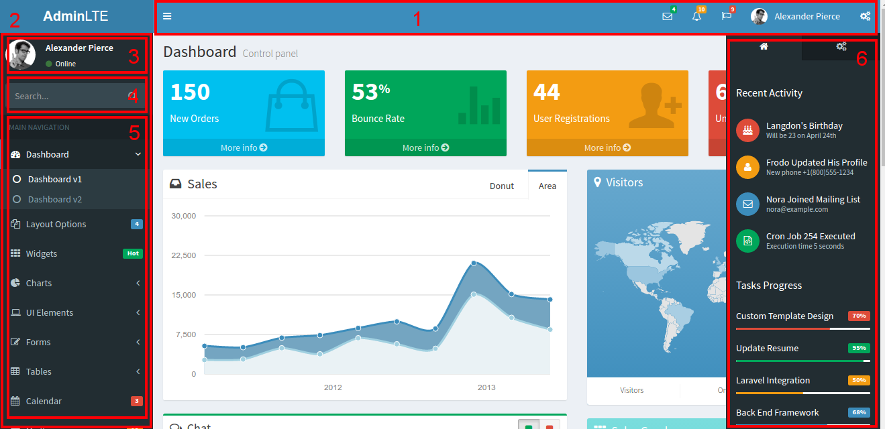

[](https://waffle.io/maiconpinto/cakephp-adminlte-theme)
# CakePHP AdminLTE Theme

## Installation

You can install using [composer](http://getcomposer.org).

```
composer require maiconpinto/cakephp-adminlte-theme
```

### Enable Plugin

```php
// config/bootstrap.php

Plugin::load('AdminLTE', ['bootstrap' => true, 'routes' => true]);
```

### Enable theme

```php
// src/Controller/AppController.php

public function beforeRender(Event $event)
{
    $this->viewBuilder()->theme('AdminLTE');
}
```

### Enable Form

```php
// src/View/AppView.php

public function initialize()
{
    $this->loadHelper('Form', ['className' => 'AdminLTE.Form']);
}
```

### ~Configure~ (deprecated in 1.0.6)

```php
// src/Controller/AppController.php
use Cake\Core\Configure;

public function beforeRender(Event $event)
{
    // ...
    $this->set('theme', Configure::read('Theme'));
}
```

```php
// To customize configuration paste it at end of file config/bootstrap.php

Configure::write('Theme', [
    'title' => 'AdminLTE',
    'logo' => [
        'mini' => '<b>A</b>LT',
        'large' => '<b>Admin</b>LTE'
    ],
    'login' => [
        'show_remember' => true,
        'show_register' => true,
        'show_social' => true
    ],
    'folder' => ROOT,
    'skin' => 'blue' // default is 'blue'
]);
```

### ~Customize Layout~ (deprecated in 1.0.6)

Replace the files according to the image.



1. `src/Template/Element/nav-top.ctp`
2. `src/Template/Element/aside-main-sidebar.ctp`
3. `src/Template/Element/aside/user-panel.ctp`
4. `src/Template/Element/aside/form.ctp`
5. `src/Template/Element/aside/sidebar-menu.ctp`
6. `src/Template/Element/aside-control-sidebar.ctp`
7. `src/Template/Element/footer.ctp`

Remember to remove the initial PHP block and the final closing brace when copying the desired template element to customize.

### Customize Layout (from 1.0.6)

```php
// src/Controller/AppController.php
use Cake\Core\Configure;

public function beforeRender(Event $event)
{
    // ...
    $this->viewBuilder()->className('AdminLTE.AdminLTE');
}
```

After you enable the AdminLTEView class in the AppController.php file, you can overwrite any View file, only by creating the `Plugin/AdminLTE/` folder inside the `Template` folder.

For example, to overwrite the elements files, you must create them as follows:

1. `src/Template/Plugin/AdminLTE/Element/nav-top.ctp`
2. `src/Template/Plugin/AdminLTE/Element/aside-main-sidebar.ctp`
3. `src/Template/Plugin/AdminLTE/Element/aside/user-panel.ctp`
4. `src/Template/Plugin/AdminLTE/Element/aside/form.ctp`
5. `src/Template/Plugin/AdminLTE/Element/aside/sidebar-menu.ctp`
6. `src/Template/Plugin/AdminLTE/Element/aside-control-sidebar.ctp`
7. `src/Template/Plugin/AdminLTE/Element/footer.ctp`

The biggest news is that you can override elements also for prefixes. This means that you can have a footer element, for an environment that has an Admin prefix, and a different footer element for the environment that has no prefix.

For example:

1. `src/Template/Plugin/AdminLTE/Element/footer.ctp`
1. `src/Template/Plugin/AdminLTE/Admin/Element/footer.ctp`

In summary, the sequence of folders in which to check if that file exists is as follows:

1. `src/Template/Plugin/$theme/Plugin/$plugin/$prefix/`
2. `src/Template/Plugin/$theme/Plugin/$plugin/`
3. `src/Template/Plugin/$theme/$prefix/`
4. `src/Template/Plugin/$theme/`

For example, Let's say:

* $theme = 'AdminLTE';
* $plugin = 'SupportTicket';
* $prefix = 'Admin';

Therefore, the sequence that would verify the existence of a file, would be the following:

1. `src/Template/Plugin/AdminLTE/Plugin/SupportTicket/Admin/`
2. `src/Template/Plugin/AdminLTE/Plugin/SupportTicket/`
3. `src/Template/Plugin/AdminLTE/Admin/`
4. `src/Template/Plugin/AdminLTE/`

For the sake of clarity, let's say you have two environments separated by different prefixes: *Panel* and *Admin*.

The *Dashboard* enviroment has no menu and footer, but Admin has.

To solve this situation is very simple. You should create in the folder `src/Template/Plugin/AdminLTE/Panel/` the elements `aside/sidebar-menu.ctp` and` footer.ctp` with empty content.

However, for *Admin*, you should create `aside/sidebar-menu.ctp` in `src/Template/Plugin/AdminLTE/Admin/` or if you want to leave general, regardless of prefix, you should create in `src/Template/Plugin/AdminLTE/`. Similarly with the `footer.ctp`.

### Page debug

Added link to default page of CakePHP.


## Contributing

1. Fork it
2. Create your feature branch (`git checkout -b my-new-feature`)
3. Commit your changes (`git commit -am 'Add some feature'`)
4. Push to the branch (`git push origin my-new-feature`)
5. Create new Pull Request
