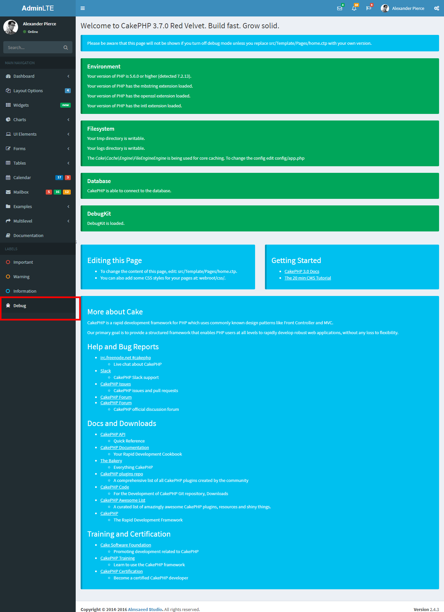

# CakePHP AdminLTE Theme

## Installation

You can install using [composer](http://getcomposer.org).

```
composer require maiconpinto/cakephp-adminlte-theme
```

### Enable Plugin

```php
// config/bootstrap.php

Plugin::load('AdminLTE', ['bootstrap' => true, 'routes' => true]);

```

### Enable theme

```php
// src/Controller/AppController.php

public function beforeRender(Event $event)
{
    $this->viewBuilder()->setTheme('AdminLTE');

    // For CakePHP before 3.5
    $this->viewBuilder()->theme('AdminLTE');
}
```

### Enable Form

```php
// src/View/AppView.php

public function initialize()
{
    $this->loadHelper('Form', ['className' => 'AdminLTE.Form']);
}
```

### Configure

```php
// To customize configuration paste it at end of file config/bootstrap.php

Configure::write('Theme', [
    'title' => 'AdminLTE',
    'logo' => [
        'mini' => '<b>A</b>LT',
        'large' => '<b>Admin</b>LTE'
    ],
    'login' => [
        'show_remember' => true,
        'show_register' => true,
        'show_social' => true
    ],
    'folder' => ROOT,
    'skin' => 'blue' // default is 'blue'
]);
```

### Customize Layout

If you want to [Customize Layout](https://github.com/maiconpinto/cakephp-adminlte-theme/wiki/Customize-Layout)

### Page debug

Added link to default page of CakePHP.



## Contributing

1. Fork it
2. Create your feature branch (`git checkout -b my-new-feature`)
3. Commit your changes (`git commit -am 'Add some feature'`)
4. Push to the branch (`git push origin my-new-feature`)
5. Create new Pull Request
